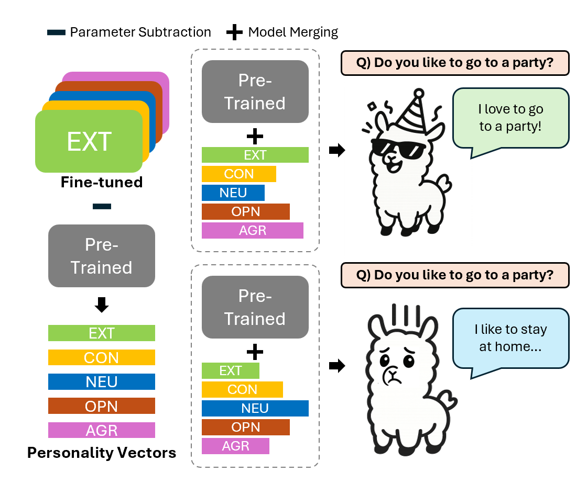

# Personality Vector: Modulating Personality of Large Language Models by Model Merging

### Paper Link 👉  [](https://arxiv.org/abs/2509.19727)


### Personality Vector Project


This repository includes scripts for merging models and evaluating them through interview tasks.

## How to Merge Models

To merge models, run the following command:

```bash
bash model_merge/merge.sh
```
## How to Evaluate the Merged Model

To evaluate the merged model with interview prompts, run:

```bash
bash interview/interview.sh
```
